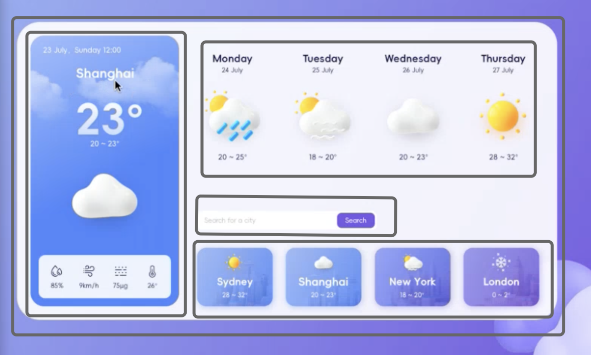

# Step1: Break the UI into a component hierarchy 


### File crate
```plaintext
- weatherapp
    -src
      -assets
        ...
      -Component
        -BackgroundImage
            -BackgroundImage.js
            -index.js
        -WeatherCard
            -Component
                -CurrentCity
                -Forest
                -SearchBar
                -OtherCity
            -WeatherCard.js
            -index.js
                
